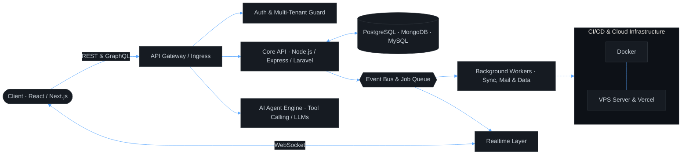
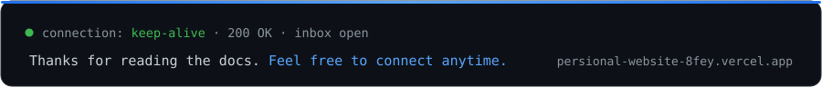

<div align="center">
  <!-- Dynamic Typing Header -->
  
  <br/><br/>

  <!-- Terminal Session Status -->
  
  <br/><br/>

  <!-- Microservice Status Badges -->
  
  
  
  
  <a href="https://github.com/rowshanara01"></a>
</div>


## `GET /about`

```jsonc
{
  "name": "Rowshanara Akhter",
  "role": "Full-Stack Software Engineer",
  "experience": "2+ years",
  "company": "EasilyPro",
  "location": "Dhaka, Bangladesh 🇧🇩",
  "specialty": "architecting intelligent agentic workflows & high-performance SaaS platforms",
  "currently": {
    "building": "multi-tenant SaaS platforms & AI agent-driven recruiting systems",
    "learning": [
        "Agentic AI workflows",
        "Distributed system architecture",
        "LLM tool calling & reasoning"
    ],
    "reading": "system architecture & AI workflow benchmarks"
  },
  "principles": [
      "First, understand the system domain. Then, architect the pipeline.",
      "Clean interfaces, deterministic data flow, and resilient state.",
      "Empower humans with autonomous, testable AI tool chains."
  ],
  "openTo": [
      "full-time opportunities",
      "innovative SaaS contracts",
      "open source AI tooling"
  ]
}
```


## `GET /architecture`

The system architecture I build and optimize daily — modern client layers, resilient API gateway, intelligent AI orchestrators, relational & document stores, automated deployment pipelines.




## `GET /endpoints`

| Method | Endpoint | Returns | Status |
| :--- | :--- | :--- | :--- |
| `GET` | `/skills/frontend` | React · Next.js · TypeScript · Redux · Tailwind CSS | `200 OK` |
| `GET` | `/skills/backend` | Node.js · Express · REST APIs · Laravel · Microservices | `200 OK` |
| `GET` | `/skills/ai-agentic` | Agentic Workflows · Tool Calling · LLM Orchestration · OpenAI API | `200 OK` |
| `GET` | `/skills/data` | MongoDB · MySQL · PostgreSQL · Schema Optimization | `200 OK` |
| `GET` | `/skills/devops` | Git · GitHub Actions · Docker · VPS Automation · Vercel | `200 OK` |
| `GET` | `/learning` | distributed systems · agentic autonomous patterns · high-scale SaaS | `206 Partial Content` |
| `POST` | `/collaborate` | innovative SaaS platforms, agentic AI tools, open source | `202 Accepted` |
| `POST` | `/hire` | full-stack engineer and AI developer opportunities | `202 Accepted` |
| `DELETE` | `/tech-debt` | proactive refactors, modular architecture, performance audits | `204 No Content` |
| `GET` | `/free-time` | coding, reading technical specs, building side projects | `503 Service Unavailable` |


## `GET /dependencies`

```jsonc
{
  "name": "@rowshanara01/software-engineer",
  "version": "2.4.0",
  "main": "problem-solving.ts",
  "engines": { "curiosity": ">=1.0.0", "coffee": "^2 cups/day" },
  "dependencies": {
    "typescript": "^5.x",
    "react": "^19.x",
    "next": "^15.x",
    "nodejs": "^22.x",
    "express": "^4.x",
    "mongodb": "*",
    "mysql": "*",
    "tailwindcss": "^4.x"
  },
  "devDependencies": {
    "agentic-ai": "^1.x",
    "docker": "*",
    "git": "*",
    "python": "^3.x",
    "postman": "*"
  },
  "scripts": {
    "start": "understand the core problem",
    "build": "architect clean scalable code",
    "deploy": "ship to production with automated tests"
  }
}
```

<div align="center">
  <br/>
  
  <br/><br/>
  
</div>


## `GET /projects`

<table width="100%" border="0">
  <tr>
    <td width="50%" valign="top" style="padding: 12px; background-color: #0d1117; border-radius: 8px;">
      <h4>🔵 <a href="https://ai-job-matcher-frontend-ebon.vercel.app/" target="_blank"><b>AI Job Matcher & Agentic Recruiter</b></a></h4>
      <sub><b>FEATURED AI PLATFORM</b></sub><br/>
      <p>AI-driven job matching platform connecting candidates with intelligent recommendations, resume analysis, and automated workflows.</p>
      <code>React / Node.js / Agentic AI / OpenAI API</code>
    </td>
    <td width="50%" valign="top" style="padding: 12px; background-color: #0d1117; border-radius: 8px;">
      <h4>🟣 <a href="https://amardokan-marketplace-ecommerce.vercel.app/" target="_blank"><b>AmarDokan Marketplace</b></a></h4>
      <sub><b>MULTI-VENDOR ECOMMERCE</b></sub><br/>
      <p>Full-featured e-commerce marketplace platform for multi-vendor stores with cart, secure checkout, and real-time inventory.</p>
      <code>Next.js / Node.js / MongoDB / Tailwind CSS</code>
    </td>
  </tr>
  <tr>
    <td width="50%" valign="top" style="padding: 12px; background-color: #0d1117; border-radius: 8px;">
      <h4>📘 <a href="https://persional-website-8fey.vercel.app/" target="_blank"><b>Developer Portfolio & Showcase</b></a></h4>
      <sub><b>INTERACTIVE WEB APP</b></sub><br/>
      <p>Interactive modern portfolio showcasing AI solutions, engineering projects, performance benchmarks, and contact avenues.</p>
      <code>React / TypeScript / Tailwind CSS / Motion</code>
    </td>
    <td width="50%" valign="top" style="padding: 12px; background-color: #0d1117; border-radius: 8px;">
      <h4>🟢 <a href="https://elite-ecommerce-shop.vercel.app" target="_blank"><b>Elite Ecommerce Shop</b></a></h4>
      <sub><b>PRODUCT SHOWCASE & STORE</b></sub><br/>
      <p>High-converting online shopping store featuring responsive UI design, lightning-fast rendering, and catalog filtering.</p>
      <code>Next.js / TypeScript / Tailwind CSS</code>
    </td>
  </tr>
</table>


## `GET /metrics`

<div align="center">
  
  
  <br/><br/>
  
</div>

### `tail -f /var/log/commits`

<div align="center">
  
</div>

### `tail -f /var/log/contributions/snake`

<div align="center">
  <picture>
    <source media="(prefers-color-scheme: dark)" srcset="https://raw.githubusercontent.com/rowshanara01/rowshanara01/output/github-contribution-grid-snake-dark.svg">
    <source media="(prefers-color-scheme: light)" srcset="https://raw.githubusercontent.com/rowshanara01/rowshanara01/output/github-contribution-grid-snake.svg">
    
  </picture>
</div>


## `GET /changelog`

> **`v2.4.0`** — *current*
> Deep in Agentic AI workflows & multi-tenant SaaS architecture at EasilyPro. Resolving complex API integration, automated VPS deployments, and tenant-based security isolation.
>
> **`v2.0.0`** — the SaaS & full-stack leap
> Shipped full-stack marketplace systems, auth flows, MongoDB & MySQL database schemas, and AI job matching tools.
>
> **`v1.0.0`** — first commit
> React, modern JavaScript, component architecture, and continuous curiosity.


## `GET /sla`

| Metric | Target |
| :--- | :--- |
| First response | under 24 hours |
| Peak hours | 09:00 – 23:00 (UTC+6) |
| Preferred protocol | LinkedIn · Email |
| Rate limit | 2 active projects concurrent |
| Accepts | code review, architecture debates, AI workflow discussion |
| Rejects | "build Facebook clone in 24 hours with $50" |


## `POST /subscribe`

<div align="left">
  <a href="https://github.com/rowshanara01"></a>
  <a href="https://www.linkedin.com/in/rowshanara-akhter-4a8042258/"></a>
  <a href="mailto:rowshanaraakhter9@gmail.com"></a>
  <a href="https://wa.me/01779524129"></a>
  <a href="https://persional-website-8fey.vercel.app/"></a>
</div>

---

## 💡 Dev Philosophy

<div align="center">
  > *"First, understand the system domain. Then, architect the pipeline with clean code and resilient state."*
  > 
  > — clean architecture · scalable engineering · AI empowerment
</div>

<br/>
<div align="center">
  
</div>

<div align="center">
  
</div>
